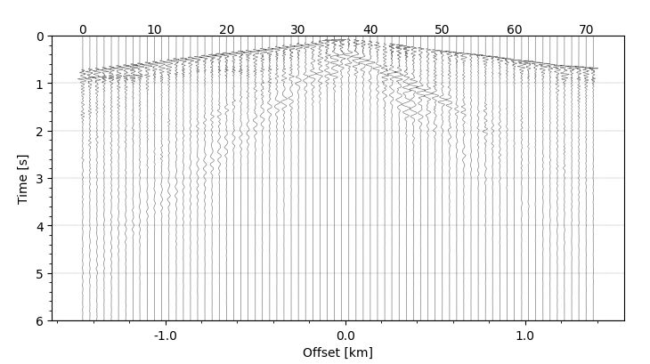
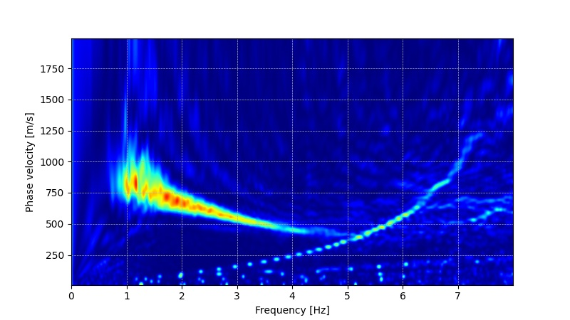

# SegdProcessMasw
## Description
依赖库：obspy numpy matplotlib utm
脚本方法主要参考Park et al. 1998.，其中source文件夹为segy数据，运行main.py
## Function parameter explain
### st_new = segd_analysis.source_xkm(ShotGather,SourceTrace,CutTraceNum)
```
截取震源附近的道集仅适用于segd文件(cut traces nearly the source)
ShotGather 道集数据，以obspy读取的segd文件为准，需要包含完整的检波点坐标与震源坐标数据
SourceTrace 新截取的道集中的震源位置
CutTraceNum 新截取的道集中总道数
返回一个新的道集
```
### 地震波形 (seismic waves form)
### figure = segd_analysis.plot_sesmic_wave(st_new,48,6,10,(7.3,4.1)) # 依赖库utm，48是zone号，用于将投影转换为经纬度

### f,c,img,fmax_idx,U,t = segd_analysis.get_dispersion(st_new,dx,cmin,cmax,dc,fmax)
```
st_new 道集数据，以obspy读取数据为准
dx 道间距
cmin,cmax 最小，最大相速度m/s
dc 相速度采样间隔m/s
fmax 最大频率
```
###
### 频散特征(dispersion spectrum)



## Reference paper
Chen Si, Gao Rui, Lu Zhanwu, Zhang Xinyan, Li Wenhui, Liang Yao, Cheng Yongzhi, Wang Guangwen. Shallow shear wave velocity structure of the Dongshan sag area using surface wave data in a deep reflection profile of the Yuanmou area of Yunnan province, China. Tectonophysics. 2022, 843: 229606. https://doi.org/10.1016/j.tecto.2022.229606 

The phase shift method described in: Park, C.B., Miller, R.D. and Xia, J., 1998, January. Imaging dispersion curves of surface waves on multi-channel record. In 1998 SEG Annual Meeting. Society of Exploration Geophysicists.

## Reference Code
#### https://github.com/luan-th-nguyen/PyDispersion
#### https://github.com/claudiodsf/read_segd
